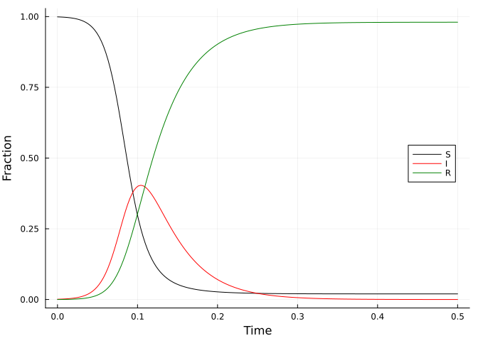
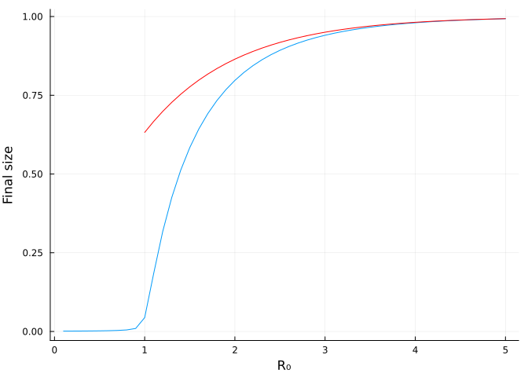
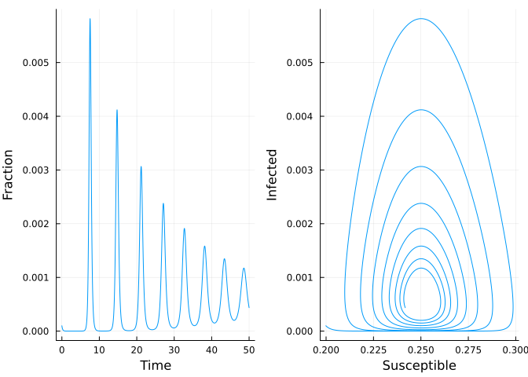

## 2.3 Numerical integration of the SIR model

::: {.cell execution_count="1"}
``` {.julia .cell-code}
using OrdinaryDiffEq
using LabelledArrays
using DataFrames
using Plots;
```
:::

Step 1: define the function.

::: {.cell execution_count="2"}
``` {.julia .cell-code}
function sirmod(u, p, t)
    S,I,R = u
    β = p.β
    μ = p.μ
    γ = p.γ
    N = p.N
    dS = μ*(N-S) - β*S*I/N
    dI = β*S*I/N - (μ+γ)*I
    dR = γ*I - μ*R
    [dS, dI, dR]
end;
```
:::

Steps 2-4: define the time, the parameters, and the initial conditions.

::: {.cell execution_count="3"}
``` {.julia .cell-code}
t0 = 0.0
t1 = 0.5
δt = 1.0/365
p = LVector(μ=0.0, N=1.0, R₀=4.0, γ=365.0/14)
p = [p; LVector(β=p.R₀*p.γ + p.μ)]
u0 = [0.999, 0.001, 0.0] .* p.N;
```
:::

Step 5: solve the model.

::: {.cell execution_count="4"}
``` {.julia .cell-code}
prob = ODEProblem(sirmod, u0, (t0, t1), p)
sol = solve(prob, Rodas5P(); saveat=δt);
```
:::

::: {.cell execution_count="5"}
``` {.julia .cell-code}
out = DataFrame(sol)
rename!(out, [:time, :S, :I, :R])
first(round.(out, digits = 3), 6)
```

::: {.cell-output .cell-output-display execution_count="62"}
```{=tex}
\begin{tabular}{r|cccc}
    & time & S & I & R\\
    \hline
    & Float64 & Float64 & Float64 & Float64\\
    \hline
    1 & 0.0 & 0.999 & 0.001 & 0.0 \\
    2 & 0.003 & 0.999 & 0.001 & 0.0 \\
    3 & 0.005 & 0.998 & 0.002 & 0.0 \\
    4 & 0.008 & 0.998 & 0.002 & 0.0 \\
    5 & 0.011 & 0.997 & 0.002 & 0.0 \\
    6 & 0.014 & 0.996 & 0.003 & 0.001 \\
\end{tabular}
```
:::
:::

::: {.cell execution_count="6"}
``` {.julia .cell-code}
plot(out.time, out.S, ylabel="Fraction", xlabel="Time", color=:black, label="S", legend=:right)
plot!(out.time, out.I, color=:red, label="I")
plot!(out.time, out.R, color=:green, label="R")
```

::: {.cell-output .cell-output-display execution_count="63"}

:::
:::

## 2.4 Final epidemic size

Find final epidemic size by running to steady state.

::: {.cell execution_count="7"}
``` {.julia .cell-code}
using SteadyStateDiffEq
ssprob = SteadyStateProblem(sirmod, u0, p)
sssol = solve(ssprob, DynamicSS(Rodas5P()))
round.(sssol, digits=2)
```

::: {.cell-output .cell-output-display execution_count="64"}
    3-element Vector{Float64}:
      0.02
     -0.0
      0.98
:::
:::

Calculate final size over a range of values of R₀.

::: {.cell execution_count="8"}
``` {.julia .cell-code}
nsims = 50
R₀ = range(0.1, 5, nsims)
betas = R₀ .* p.γ .+ p.μ
fs = Array{Float64}(undef, nsims)
for i in 1:nsims
    sp = remake(ssprob, p=LVector(μ=0.0, N=1.0, γ=365.0/14, β=betas[i]))
    ss = solve(sp, DynamicSS(Rodas5P()))
    fs[i] = ss[3]
end
```
:::

::: {.cell execution_count="9"}
``` {.julia .cell-code}
plot(R₀, fs, xlabel="R₀", ylabel="Final size", legend=false)
x = 1:0.1:5
plot!(x, 1 .- exp.(-x), color=:red)    
```

::: {.cell-output .cell-output-display execution_count="66"}

:::
:::

Use root-finding to calculate the final size.

::: {.cell execution_count="10"}
``` {.julia .cell-code}
using NonlinearSolve
fn(u, p) = exp(-(p[1]*(1-u[1]))) - u[1]
rprob = IntervalNonlinearProblem(fn, (0.0, 1.0 - 1e-9), [2.0])
rsol = solve(rprob, Falsi())
1.0 - rsol.u[1]
```

::: {.cell-output .cell-output-display execution_count="67"}
    0.7968121300200202
:::
:::

## 2.5 The open epidemic

::: {.cell execution_count="11"}
``` {.julia .cell-code}
t0 = 0.0
t1 = 50.0
δt = 1.0/365
p = LVector(μ=1.0/50, N=1.0, R₀=4.0, γ=365.0/14)
p = [p; LVector(β=p.R₀*p.γ + p.μ)]
u0 = [0.1999, 0.0001, 0.8] .* p.N
prob = ODEProblem(sirmod, u0, (t0, t1), p)
sol = solve(prob, Rodas5P(); saveat=δt)
out = DataFrame(sol)
rename!(out, [:time, :S, :I, :R]);
```
:::

::: {.cell execution_count="12"}
``` {.julia .cell-code}
l = @layout [a b]
p1 = plot(t0:δt:t1, out.I, xlabel="Time", ylabel="Fraction", legend=false)
p2 = plot(out.S, out.I, xlabel="Susceptible", ylabel="Infected", legend=false)
plot(p1, p2, layout=l)
```

::: {.cell-output .cell-output-display execution_count="69"}

:::
:::
